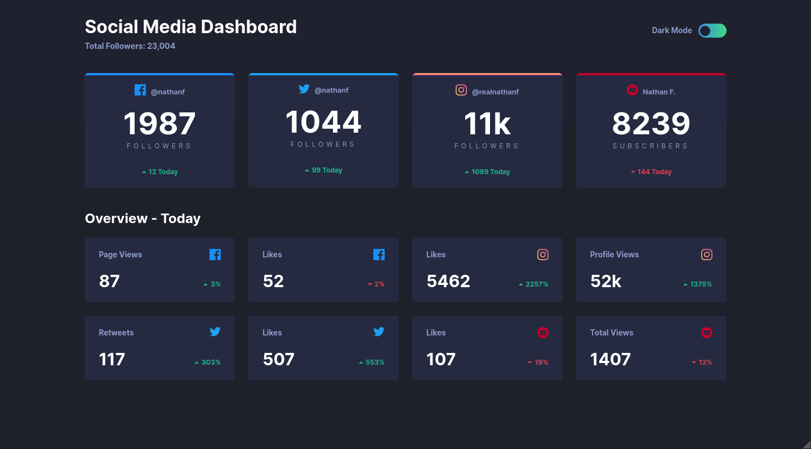

# Social Media Dashboard with theme switcher

This is my solution for the [Frontend Mentor challenge](https://www.frontendmentor.io/challenges/social-media-dashboard-with-theme-switcher-6oY8ozp_H) built in [Svelte](https://svelte.dev/).
You can find the demo [here](https://eloquent-saha-870ace.netlify.app/) and four screenshots down below (desktop with a width of 1440 and mobile with a width of 375):

